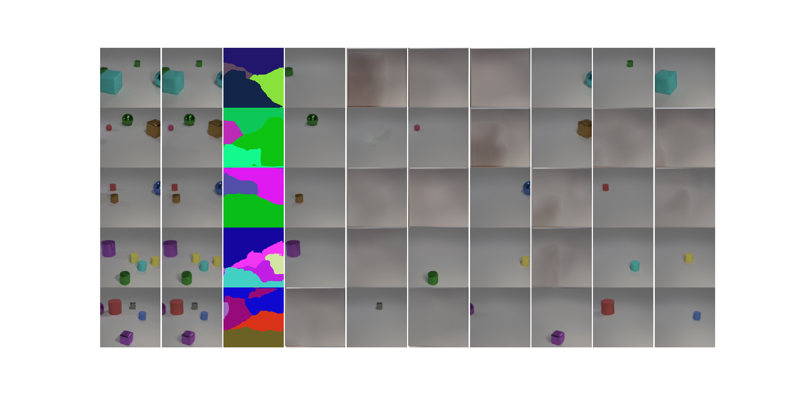
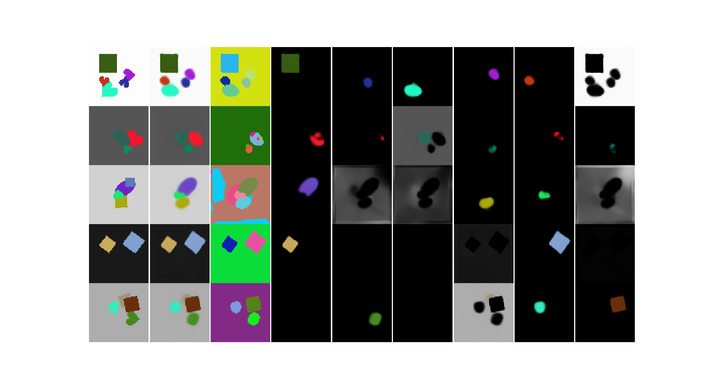
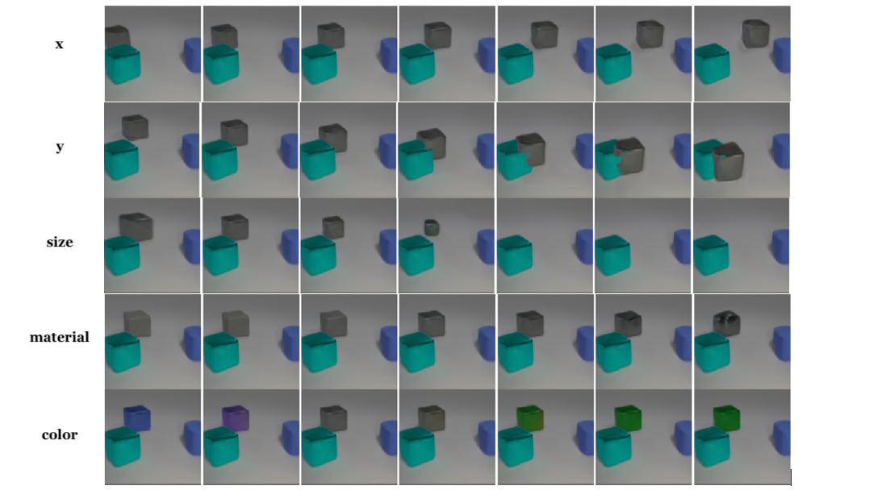
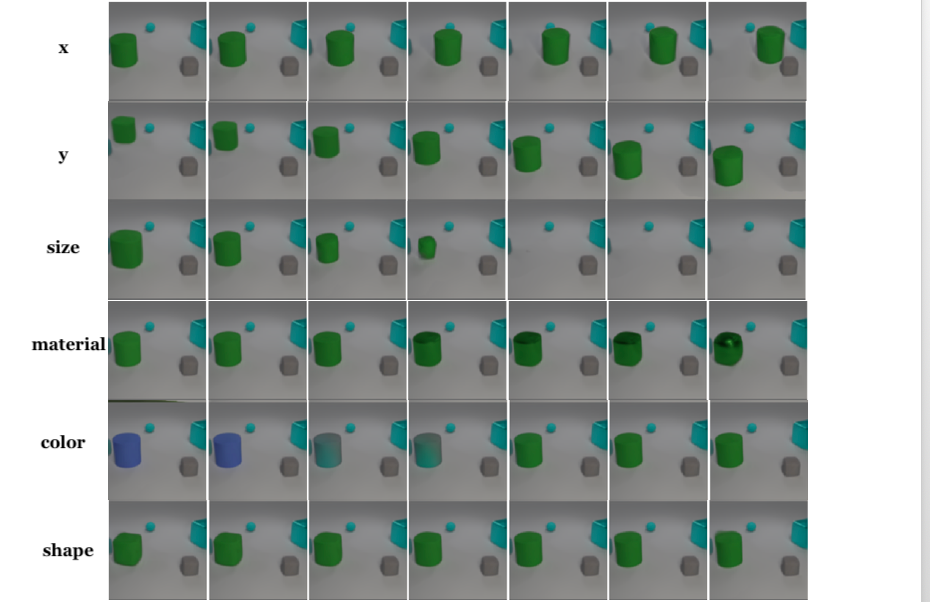
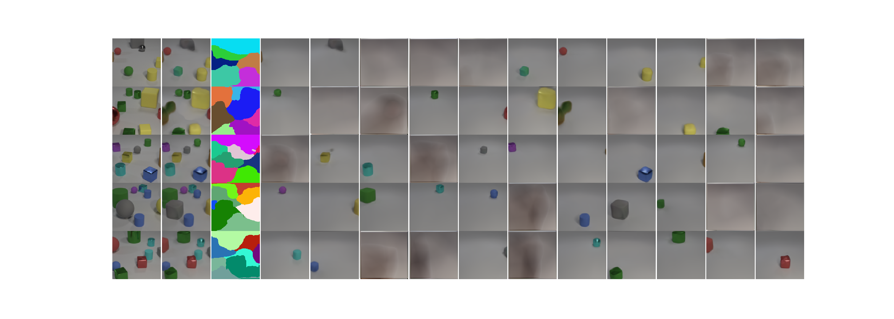
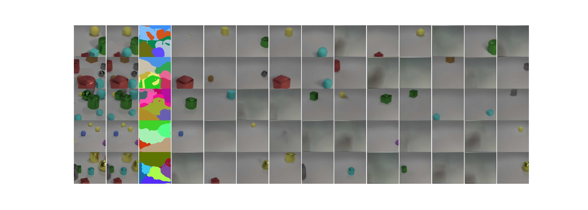

# IODINE

This is an attempt to implement the IODINE model described in [Multi-Object Representation Learning with Iterative Variational Inference](https://arxiv.org/abs/1903.00450). 

The model is trained and tested on the CLEVR6 and multi-dsprites datasets. 

## Training and testing

**Dataset**. Put your own dataset under `data/`. The directory should look like:

```
data/
    MYDATASET/
        pic0.png
        pic1.png
        ...
```

Then in `lib/data/`, write your own dataset class. Dataset class should return image and mask as in `clevr.py`, but you can set mask to `None`. You can directly copy `clevr.py` to accomodate your dataset. After that, in `lib/data/build.py`, add your dataset to the `make_dataset` function.

**Configuration**. Configuration files should in folder `config`. See `configs/clevr6_prop.yaml`. To train the model in your own dataset, you will need to modify dataset names in the `.yaml` files. The name should be the one your choose in the `make_dataset` function.

**Training.** Run 

```
python tools/train_net.py --config-file [PATH_TO_CONFIG_FILE]
```

to train. For example, `python tools/train_net.py --config-file configs/clevr6_prop.yaml`

**Visualization**. Just `tensorboard --logdir=logs --port=6006`.


## Results

**Decomposition**. The model learns to decompose objects into seperate images. Also, segmentation masks are learned. Results on CLEVR6:



The following are reconstruction results on multi-dsprites. Note in this figure, the individual decomposed images are masked with the predicted masks. Note the model struggles to to learn sharp object boundaries. This is also mentioned in the original paper.



For quantitative results, I measured ARI as in the paper. Results:

|                | this implementation | original paper |
| -------------- | ------------------- | -------------- |
| CLEVR6         | 0.971               | 0.988          |
| multi-dsprites | 0.740               | 0.767          |

There is a small gap between my implementation and results in the original paper. This might be due to minor differences in implementation.

**Disentanglement**. The following figure shows that the model learns to disentangle latent factors:



During training, I found the factor "shape" is the most difficult to capture. But the model finally learned to do so. For example, the following latent traversal shows that the model captures the factor "shape":



**Generalization**. The original paper reported that the model generalizes to scenes with more objects that seen during training. This is partially true in my experiments. The following are some decomposition results on the full CLEVR dataset:



The above scenes are carefully selected by me. When I tested on the full CLEVR dataset, sometimes even though the number of objects is less then 6, the results can be pretty bad:



I suspect that this is because I generated the CLEVR6 myself, and some rendering parameters that I chosen are different from those of the original CLEVR dataset.
