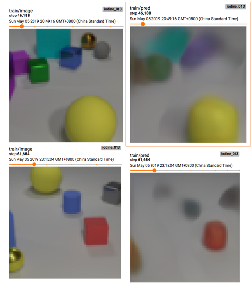
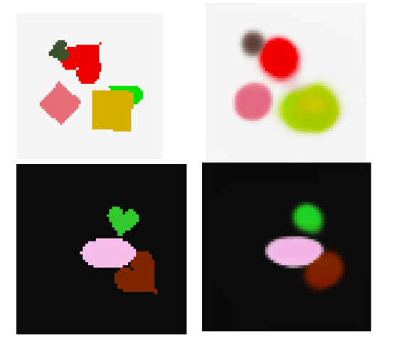
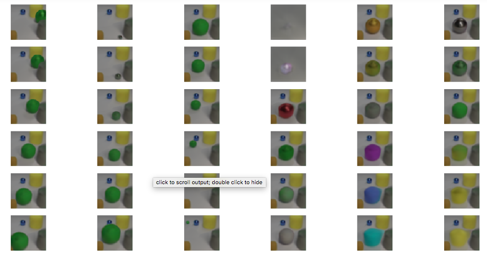
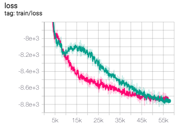
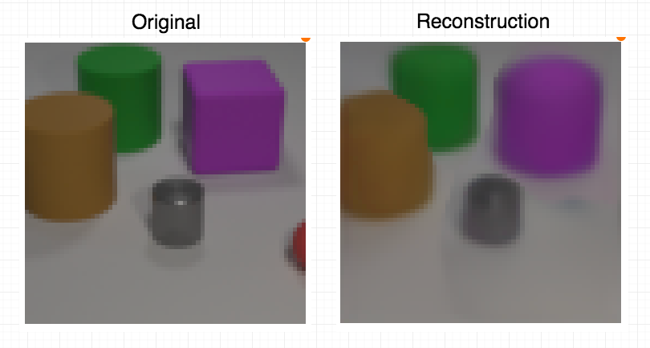
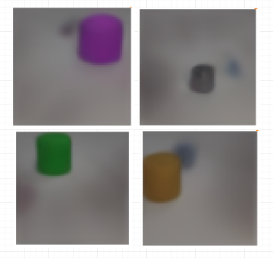
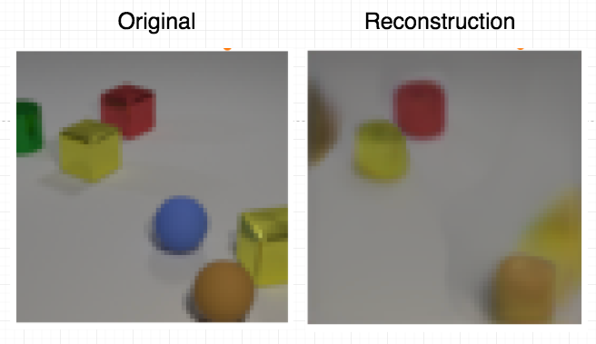
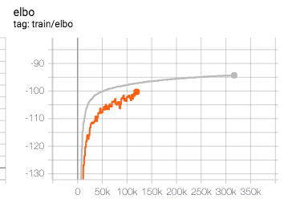
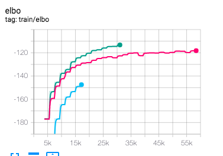

# 5-27

I modified the model according to the revised version of the paper. This includes new model architecture, global sigma, input format, dataset generation and so on. This time I trained on full-size images so it takes even longer to train (1.7s per batch, on 4 GPUs), and the training is still undergoing. But model at earlier iterations (50000 or so) already shows a better result. The following reconstructions are from the **older** implementation, at early steps (40000-60000):

And the following is from the current **modified** implementation:

Compared this with previous reconstruction result at the same step, we can see the visual quality has significantly improved.

# 5-21

The author of Multi-Object Representaiont Learning have submitted a revised version on Arxiv last week, in which they clarified many details. There are many differences between their and my implementations, so I will modify mine to match their description. The current results from my implementation below do not seem satisfying, and I think this is due to these implementation details. The following results are from my current implementation.

I trained the network on Multi-dSprites. It captures position, size and color, but it struggles to capture sharp shapes. This is also mentioned in the paper and they also don't know why. The following are two reconstruction examples:

I also measured ARI on Multi-dSprites. There is a obvious gap. This might be due to variation in our implementation.

| Mine  | Reported |
| ----- | -------- |
| 0.680 | 0.767    |

I also try to reproduced the figure demonstrating disentanglement on CLEVR. In this figure, each column corresponds to variation in one latent unit. Latent units are ranked according to variance. It can be seen that some disentanglement is achieved, but not so well. Size and position in the first three columns are coupled, for example.

# 5-13

Implemented more input encodings to the refinement network. It seems that layer normalization did help stabalize training, as seen below. The green curve is without layer normalization.

# 5-6

Implemented the pipeline and trained the model on CLEVR. Only used images and gradients of posterior as inputs to the refinement network. Hyperparameters are as those in the paper, except $\sigma^2$ of the data likelihood. I scaled the images to 64x64 since this is what fits in 4 GPUs.

The model did learn how to segment and reconstruct. The following is an example:

And the outputs (predicted mean) from 4 of the slots:

But somestimes (actually, in many cases) the reconstruction is fuzzy, and incomplete. For example, in the following reconstruction, one object is missing and and other objects are blurred:

So it works, but not very well. Current possible reasons:

* Some hyperparameters (especially $\sigma^2$) are not correct. I found $\sigma^2$ to be a very important hyperparameter (it scales the KL term and reconstruction term), but it is not given in the paper. So I tuned it myself.

* I only use the images and gradients of posterior as inputs to the refinement network. This may affect performance. 
* They do not describe how they feed the gradients of posterior to the refinement network (the input to the refinement network should be image sized), so I assume that sampled $z_k$ is spatial broadcasted as done during decoding. This might cause problems.
* I do not apply gradient cutting as in the paper. A possible reason?

# 4-29

Implemented some iterative inference models. Found that some factors that are especially important:

* Encode input, in addition to gradients
* Must use elu instead of relu. Possibly because the signs of the gradients 
  matter a lot.
* Using gated update form and highway connection in MLP is very helpful.

Encoding input vs. no input:

Three lines are respectively: 

* ELU + gated update
* ELU
* No ELU

